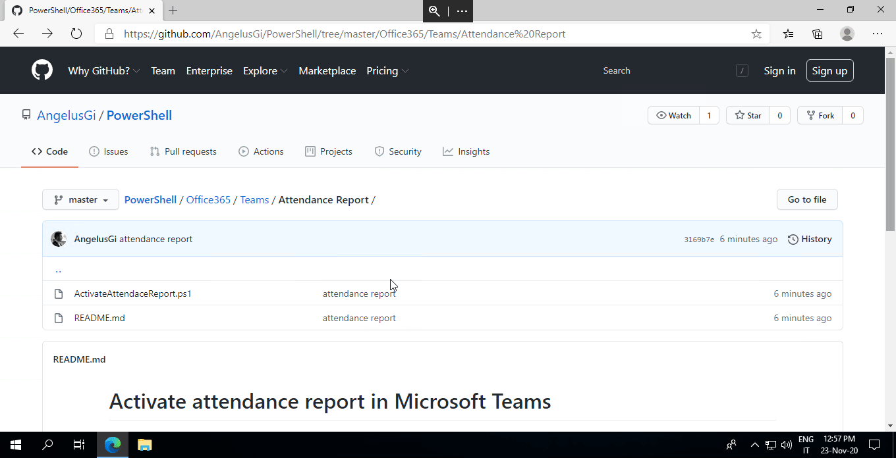

# Download a single file from a GitHub repository

If you want to download a single file from this repositoy, please follow this procedure:
* Go to the right path of the repositosy
* Click on the file name
* Click on the "Raw" button
* Right mouse click and "save as" on your PC
 
 
