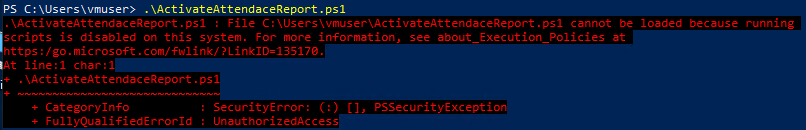
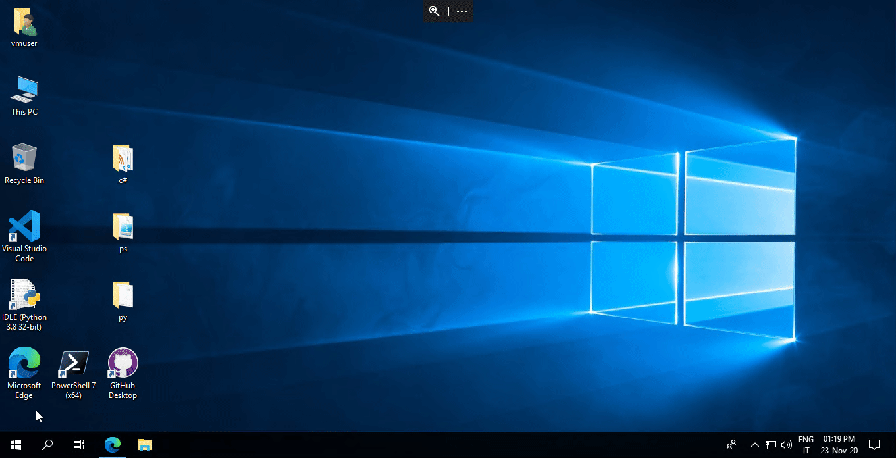

# How to resolve porblems about Execution Policy

Running a PowerShell script form this repository, if you recieve an error message like this
>File %USERPROFILE%\ScriptName.ps1 cannot be loaded because running
>scripts is disabled on this system. For more information, see about_Execution_Policies at
>https:/go.microsoft.com/fwlink/?LinkID=135170.

follow this procedure:
* Open PowerShell as Administrator
* Run the command  
<code>Set-ExecutionPolicy -ExecutionPolicy Unrestricted -Scope CurrentUser</code>
 
 
